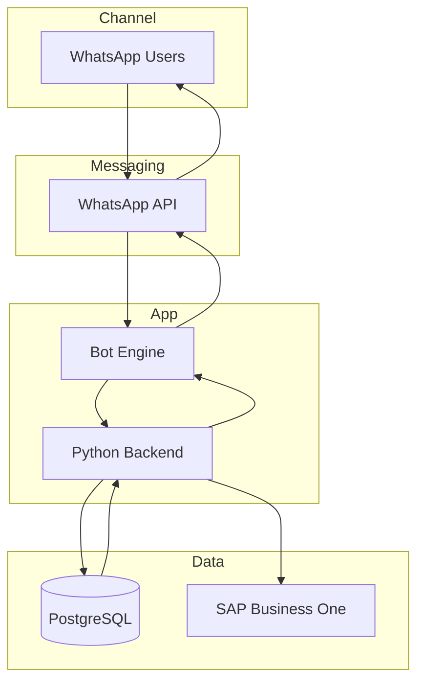

# SalesBot for WhatsApp – Architecture

```mermaid
flowchart TB
    subgraph Channel
        U[WhatsApp Users]
    end

    subgraph Messaging
        W[WhatsApp API]
    end

    subgraph App
        B[Bot Engine]
        S[Python Backend]
    end

    subgraph Data
        D[(PostgreSQL)]
        E[SAP Business One]
    end

    U --> W --> B --> S
    S --> D
    S --> E
    D --> S --> B --> W --> U
```

