# SalesBot for WhatsApp  
[🇧🇷 Português](#português) | [🇺🇸 English](#english)

---

## 🇧🇷 Português

### Visão Geral
**SalesBot for WhatsApp** é uma ferramenta corporativa que leva indicadores de vendas diretamente para o WhatsApp, eliminando a dependência de dashboards e planilhas no dia a dia comercial.

Vendedores, gestores e diretoria acessam **apenas as informações que lhes cabem**, em linguagem simples, estruturada e pronta para decisão.

---

### Problema
- Baixa adoção de dashboards tradicionais  
- Tempo perdido com filtros, exportações e planilhas  
- Informação chega tarde para quem está no campo  
- Falta de visão personalizada por papel (vendedor x gestor x diretoria)

---

### Solução
Levar os dados de vendas **para onde o time já está**: o WhatsApp.

Comandos simples retornam respostas claras:
- `resumo`
- `vendas hoje`
- `vendas mês`
- `top clientes`
- `sugestões comerciais`

Tudo processado em backend e entregue em segundos no chat.

---

### Fluxo Funcional
1. Usuário envia comando no WhatsApp  
2. Bot identifica o papel do usuário  
3. Backend consulta SAP B1 via PostgreSQL  
4. Regras de negócio e segurança são aplicadas  
5. Resposta objetiva é devolvida no WhatsApp  

---

### Arquitetura (Resumo)

```mermaid
flowchart LR
    U[Usuário WhatsApp] --> W[WhatsApp API]
    W --> B[Bot Engine]
    B --> S[Backend Python]
    S --> D[(PostgreSQL)]
    D --> S
    S --> B
    B --> W
```

---

### Stack Tecnológico
- **Canal:** WhatsApp (API oficial / gateway)
- **Backend:** Python
- **Banco de Dados:** PostgreSQL
- **Origem de Dados:** SAP Business One
- **Infra:** Containers Docker
- **Segurança:** Controle de acesso por papel

---

### Segurança e Governança
- Vendedor vê apenas seus dados  
- Gestor vê apenas sua equipe  
- Diretoria/Admin tem visão consolidada  
- Nenhum dado sensível é exposto no cliente  

---

### Status
🟢 **Em produção / Rollout ativo**  

---

### O que eu liderei
- Arquitetura da solução  
- Integração SAP → PostgreSQL → WhatsApp  
- Modelagem de regras de acesso por papel  
- Entrega end-to-end em produção  

---

### Próximos Passos
- Metas e projeções no WhatsApp  
- Alertas automáticos  
- Recomendações com IA  

---

## 🇺🇸 English

### Overview
**SalesBot for WhatsApp** delivers sales KPIs directly to WhatsApp, replacing dashboards and spreadsheets with real-time, role-based insights.

---

### Problem
- Low adoption of BI dashboards  
- Time wasted filtering and exporting data  
- Sales teams need instant answers  

---

### Solution
Bring sales data to **where people already work**: WhatsApp.

---

### Architecture

---

### Tech Stack
- WhatsApp API  
- Python Backend  
- PostgreSQL  
- SAP Business One  

---

### Status
🟢 Live in production  

---

### My Role
- Architecture  
- Integration  
- Security  
- Delivery  

---

📄 Public repository – no sensitive data included
